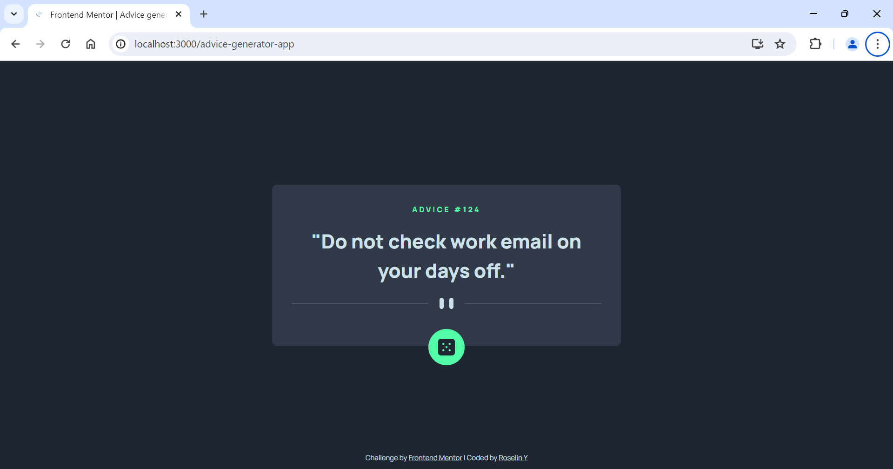

# Frontend Mentor - Advice generator app solution

This is a solution to the [Advice generator app challenge on Frontend Mentor](https://www.frontendmentor.io/challenges/advice-generator-app-QdUG-13db). Frontend Mentor challenges help you improve your coding skills by building realistic projects.

## Table of contents

- [Overview](#overview)
  - [The challenge](#the-challenge)
  - [Screenshot](#screenshot)
  - [Links](#links)
- [My process](#my-process)
  - [Built with](#built-with)
  - [Useful resources](#useful-resources)
- [Author](#author)
- [Acknowledgments](#acknowledgments)

**Note: Delete this note and update the table of contents based on what sections you keep.**

## Overview

### The challenge

Users should be able to:

- View the optimal layout for the app depending on their device's screen size
- See hover states for all interactive elements on the page
- Generate a new piece of advice by clicking the dice icon

### Screenshot

### Links

- Solution URL: [Add solution URL here](https://www.frontendmentor.io/solutions/advice-generator-app-reactjs-z_zNLhK7jH)
- Live Site URL: [Add live site URL here](https://vanillatte68.github.io/advice-generator-app)

## My process

### Built with

- Semantic HTML5 markup
- CSS custom properties
- Flexbox
- CSS Grid
- Mobile-first workflow
- [React](https://reactjs.org/) - JS library

### Useful resources

- [CSS Glow Generator - CSS Bud](https://cssbud.com/css-generator/css-glow-generator/) - CSS glow generator for button pointer event
- [Making SVGs Responsive with CSS](https://tympanus.net/codrops/2014/08/19/making-svgs-responsive-with-css/) - Some insight on how to make svg responsive

## Author

- Frontend Mentor - [Roselin Y](https://www.frontendmentor.io/profile/Vanillatte68)
